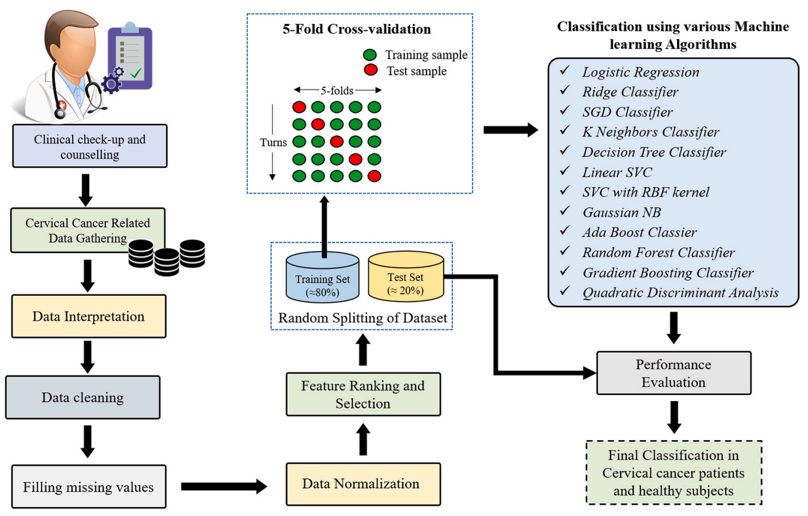
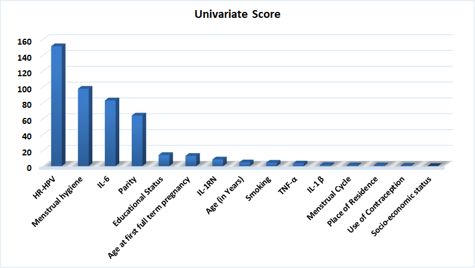
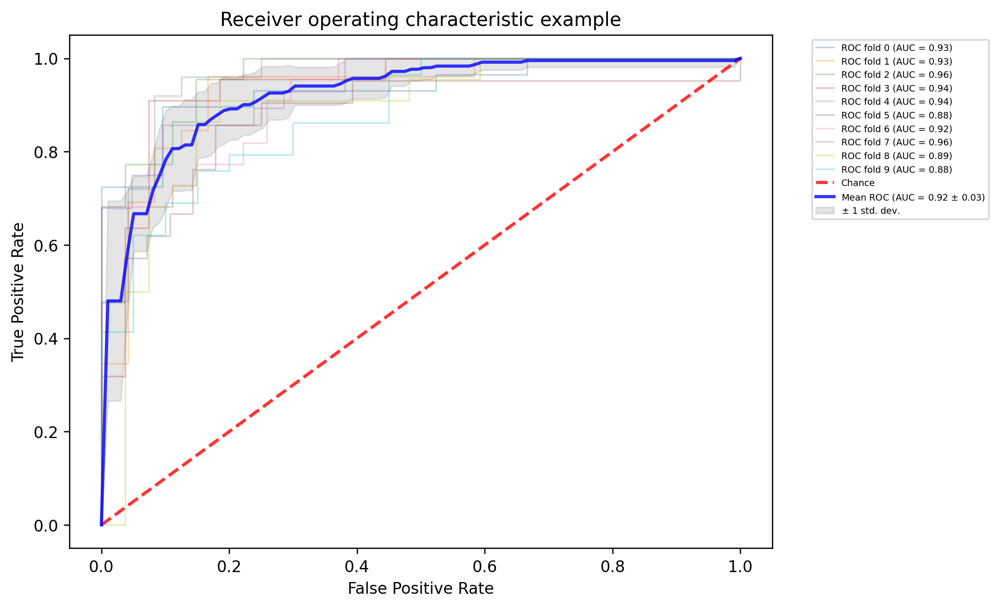

# Cervical-Cancer

## Description

This study includes the dataset of cytokine gene variants, clinical and socio-demographic characteristics of normal healthy control subjects, and cervical cancer cases. Different risk factors, including demographic details and cytokine gene variants, were analysed using different machine learning approaches. Various statistical parameters were used for evaluating the proposed method. After multi-step data processing and random splitting of the dataset, machine learning methods were applied and evaluated with 5-fold cross-validation and also tested on the unseen data records of a collected dataset for proper evaluation and analysis. The proposed approaches were verified after analysing various performance metrics.

## Workflow

## Feature Ranking

## ROC

## Citation

If you use [Cervical Cancer Analysis Code](https://github.com/manojkaushik/Cervical-Cancer) code in your research, we would appreciate a citation to the original paper:

"*Kaushik, Manoj, et al. "Cytokine gene variants and socio-demographic characteristics as predictors of cervical cancer: A machine learning approach." Computers in Biology and Medicine 134 (2021): 104559.*"

"*Kaushik, M., Joshi, R. C., Kushwah, A. S., Gupta, M. K., Banerjee, M., Burget, R., & Dutta, M. K. (2021). Cytokine gene variants and socio-demographic characteristics as predictors of cervical cancer: A machine learning approach. Computers in Biology and Medicine, 134, 104559.*"

"*Kaushik, Manoj, Rakesh Chandra Joshi, Atar Singh Kushwah, Maneesh Kumar Gupta, Monisha Banerjee, Radim Burget, and Malay Kishore Dutta. "Cytokine gene variants and socio-demographic characteristics as predictors of cervical cancer: A machine learning approach." Computers in Biology and Medicine 134 (2021): 104559.*"

"*Kaushik, M., Joshi, R.C., Kushwah, A.S., Gupta, M.K., Banerjee, M., Burget, R. and Dutta, M.K., 2021. Cytokine gene variants and socio-demographic characteristics as predictors of cervical cancer: A machine learning approach. Computers in Biology and Medicine, 134, p.104559.*"

"*Kaushik M, Joshi RC, Kushwah AS, Gupta MK, Banerjee M, Burget R, Dutta MK. Cytokine gene variants and socio-demographic characteristics as predictors of cervical cancer: A machine learning approach. Computers in Biology and Medicine. 2021 Jul 1;134:104559.*"